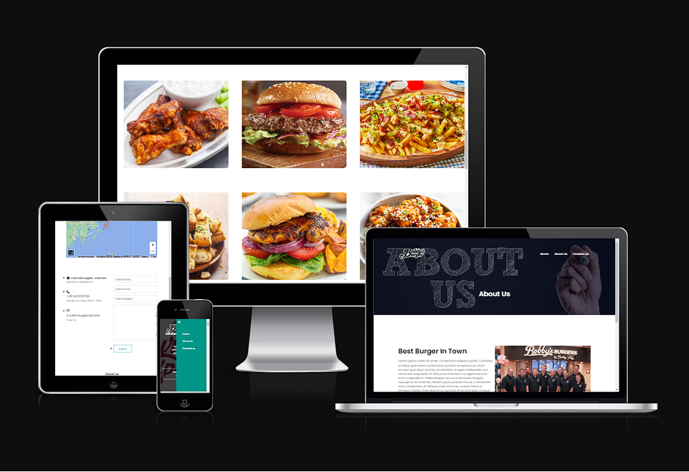
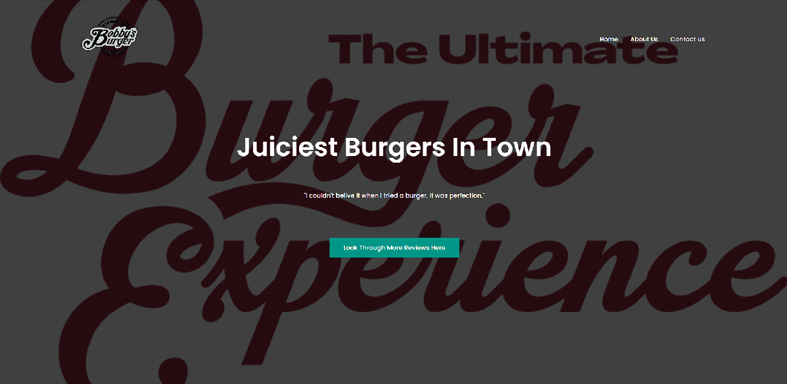
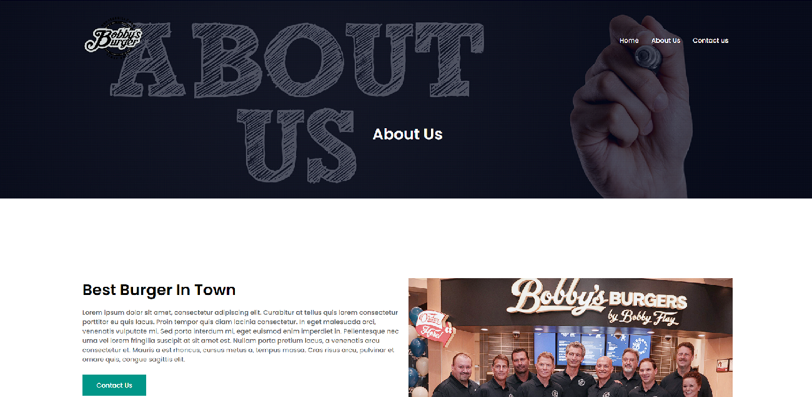
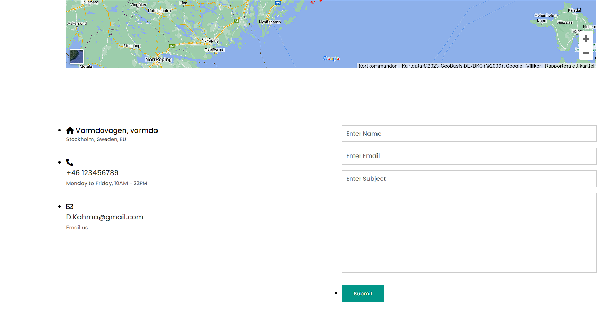
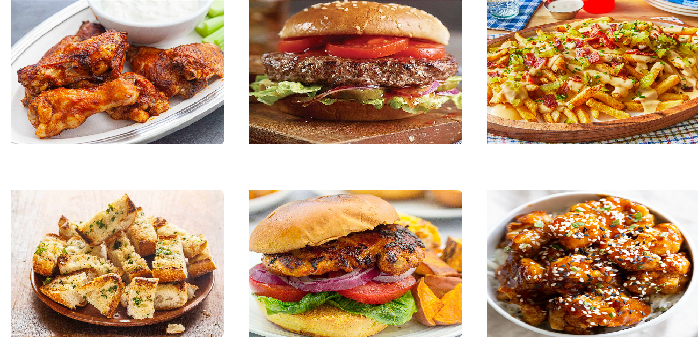
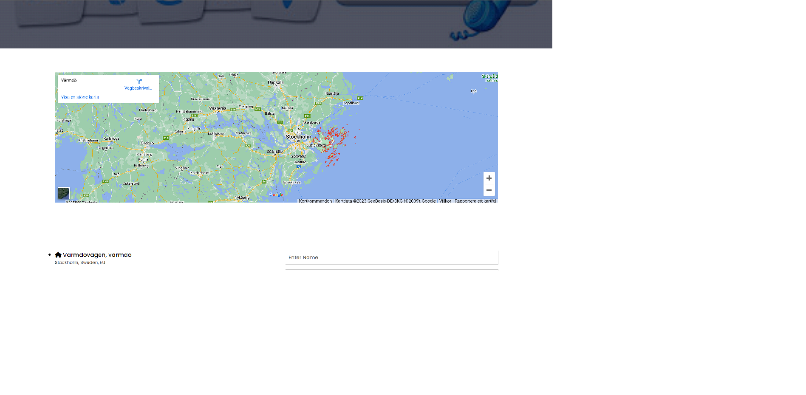
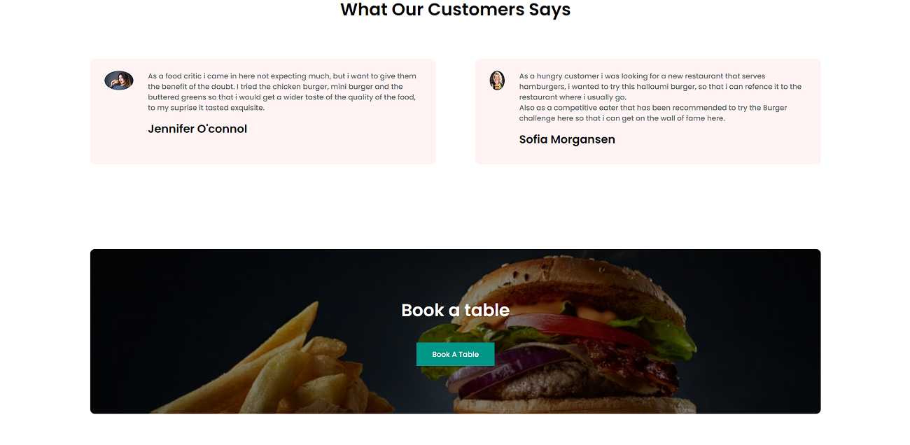
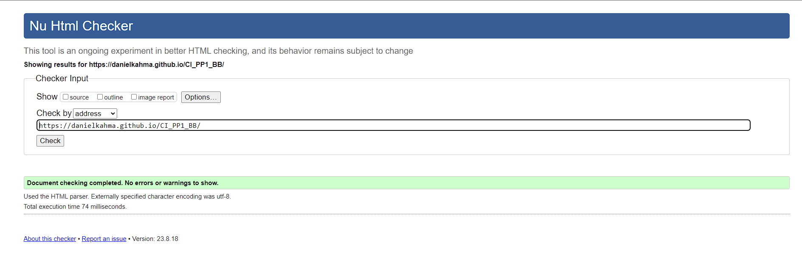
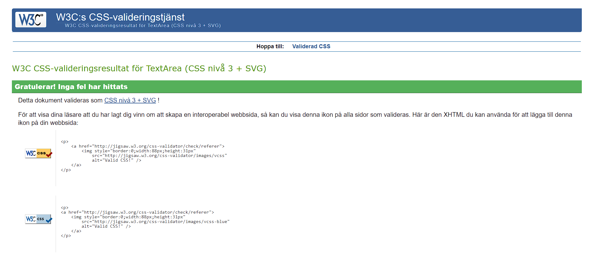
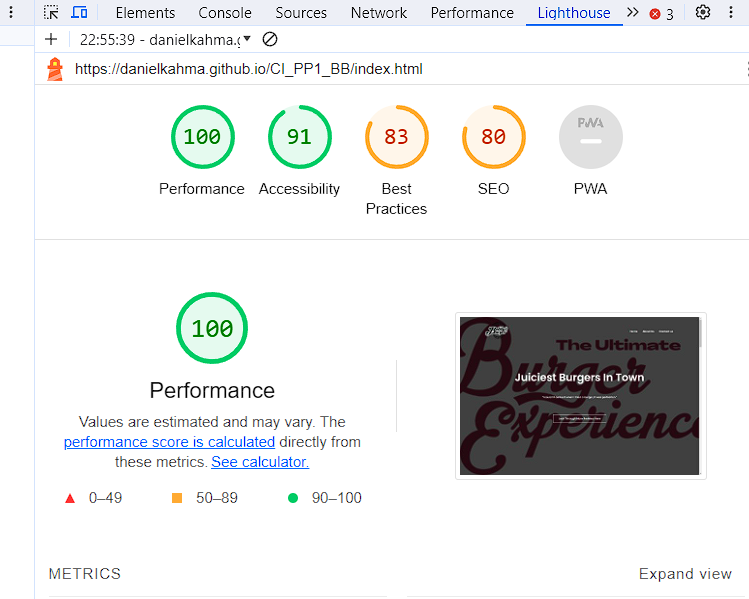

# Bobbys Burgers

Juciest Burgers In Town.

[Live webpage](https://danielkahma.github.io/CI_PP1_BB/)
## Acknowledgements

I had various inspirations when making this README, they did suck an amazing job and i took some ideas from them, please check them out below:

 - [Ana Runje](https://github.com/4n4ru/CI_MS1_BodelschwingherHof/blob/master/README.md#bodelschwinger-hof)
 
 - [Tiny Travelers](https://github.com/Apollon999/Tiny-Travelers/tree/main)
 

## Why I Made this Website

- I decided to make this website as my first project in webdevelopment 

- Because I really love hamburgers. It's very simple to use and navigate.

## Table of Content

#### 1. Project Goals

#### 2. Target Audience

#### 3. Features
   - Homepage
     
   - About Us
  
   - Contact
  
   - Food Menu
  
   - Goodle Maps
  
   - Reviews
  
#### 5. Technologies Used
   - Languages

#### 6. Validation
   - HTML Validation
  
   - CSS Validation
  
   - Lighthouse Testing

#### 7. Development And Deployment
   - Development
  
   - Deployment
  
#### 8. Content

#### 9. Design

# Project Goals

- The goals with this website is for our restaurant to enter the cyberspace.

- Make it easier for new customers to find us.
# Target Audience
- People who wants to have home delivery

- people who wants go have a nice place to meet up witht heir friends

- people who really loves hamburgers

# Features

- Bobbys Burgers has three pages, Homepage, About page and Contact page.
  
## Homepage: 

## About Us: 

## Contact: 

## Food Menu:  

## Goodle Maps:  

## Reviews:  

# Technologies Used

## Languages

- HTML

- CSS

- Google

- Youtube

- GitHub
# Validation
## HTML Validation

No errors for the official W3C validator

## CSS Validation

No errors for the CSS validation

## Lighthouse Testing

# Development And Deployment
## Development

- The development environment used for my website was GitPod and CodeAnywhere, regular commits and pushes to GitHub has been conducted. The GitPod environment was created using a template provided by Code Institute.

- The live version of the project is deployed at GitHub pages, please visit [Here](https://danielkahma.github.io/CI_PP1_BB/) 

## Deployment

 1. Log into GitHub.

2. Locate the GitHub Repository that shall be deployed live.

3. At the top of the repository, select Settings from the menu items.

4. Scroll down the Settings page to the ”GitHub Pages" section and click on the ”Deploy from a branch.”

5. At the ”Source” section choose ”main” as Branch and root as folder and click ”Save”

6. The website will deploy and the pages refreshes to provide the live link to the project.

# Content
- The content in this project is fictional, it is a project i came up with, with the help of inspiration from a lot of different places.

- I have always wanted to try a Burger challenge but have never gotten the chance, thats why i included it in my website.

- Everything written on the website is made up by me.

- Social media icons in the Footer of the website is taken from Font Awesome, as well as the "bars" and "close" icons used for the responsive menu in the top right corner

# Design
- As this is my first project ever, i have learned a lot, i got to play around and test different ideas which was really fun, i really enjoyed this project.

- My goal was to do the best i could with the limited knowledge i had and i think it was successful in making a good looking website

